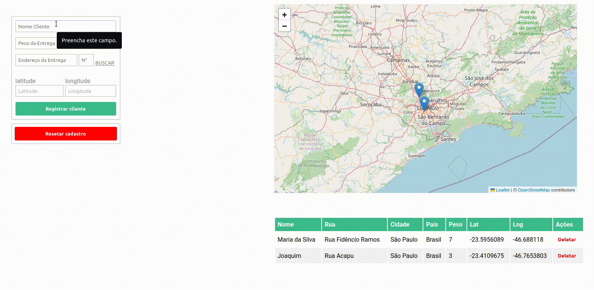

# Challenge para desenvolvedor Full Stack

Este app foi construído com:

- React.js
- Node.js
- Nominatim
- Axios
- Leaflet

#### API hospedada em [fullstackchallenge-re.herokuapp.com](https://fullstackchallenge-re.herokuapp.com)

### Demonstração



### Instruções para rodar a aplicação localmente

1. Navegue até o diretório frontend

2. Instale as dependências

```bash
npm install
```

3. Inicie a aplicaçao

```bash
npm run dev
```